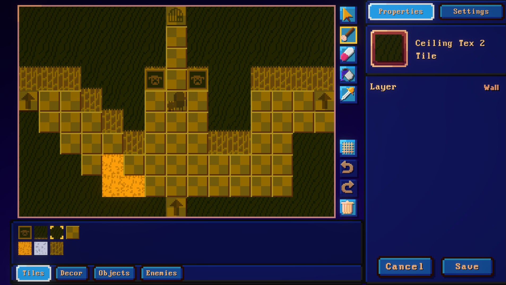
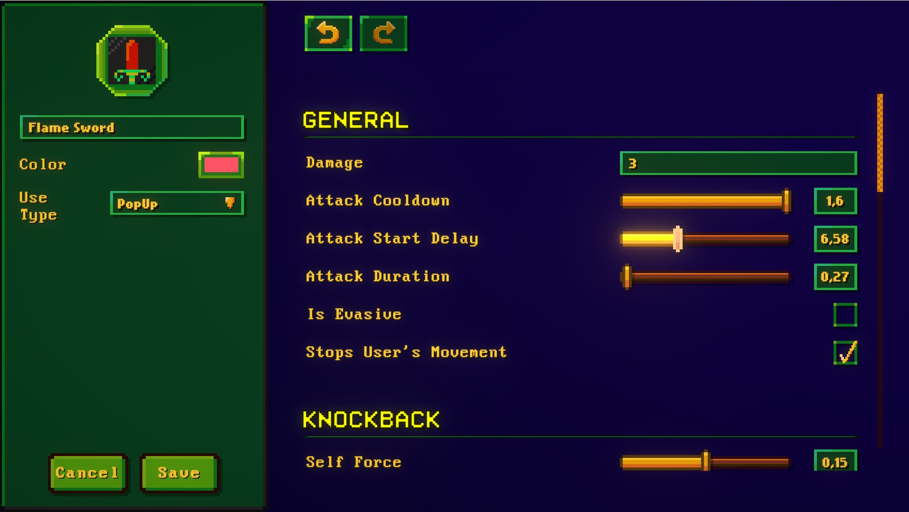
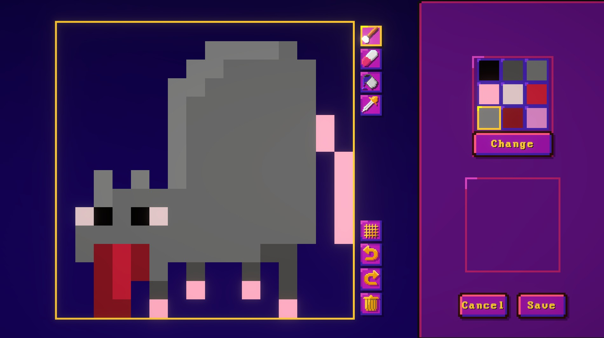
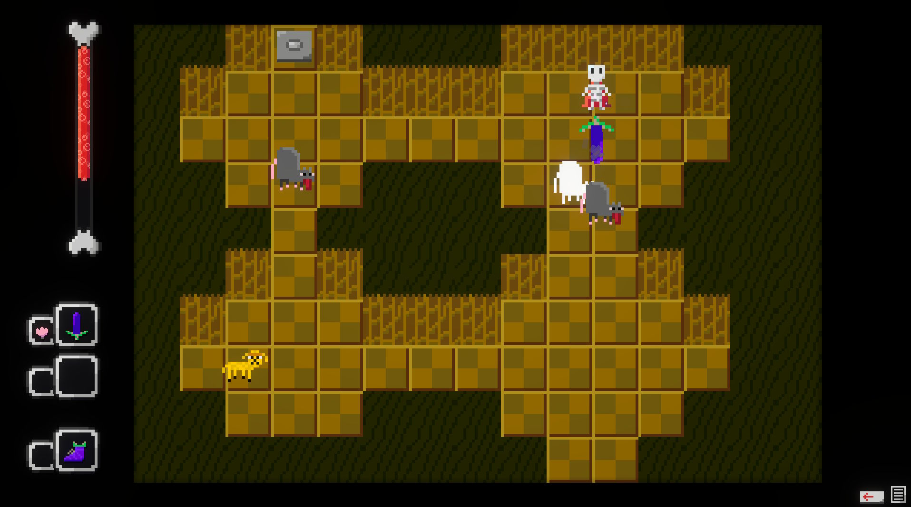



A game about travelling through dungeon floors, collecting loot, and fighting monsters. The twist? All weapons, rooms and enemies are created by the user in built-in editors!

## Download

- [Click here for the latest release](https://github.com/WaluigiNumber8/boneback-factory/releases)

## Screenshots
Room Editor - used for editing rooms the player can go through.

Weapon Editor - Edit all possible parameters of a weapon.

Sprite Editor - Used for drawing graphics of other assets.

Gameplay - Explore your custom rooms, collect weapons and fight enemies.

## Editable Assets

The game contains a built-in editor for every single of the following assets.

- **Palettes**
- **Sprites**
- **Weapons**
- **Projectiles**
- **Enemies**
- **Rooms**
- **Tiles/Decorations**
- **Campaigns**

Besides campaigns, each asset belongs under a specific pack which the user can later combine into campaigns along with additional settings. 

## Code Requirements

In order for to be able to open the project you need:

- Unity 6000.0.29f1
- Odin Inspector
- DoTween
- Rainbow Hierarchy (Alternatively can just remove *RainbowHierarchyRuleset* from both scenes)
